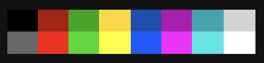

# SuperGreatMonokai

This is a theme meant for Zed users who love monokai Syntax Highlighting Colors with the VS Code editor colors!

Editor colors are based on VSCode's Dark + theme.

Syntax Highlighting Colors monokai are based on sublime text's monokai mixed with VSCode's monokai themes.

## Adds my terminal theme colors:

## Screenshot (SuperGreatMonokai):

## Credits

This theme incorporates the VSCode Monokai theme [@vscode_MonokaiTheme](https://github.com/microsoft/vscode/tree/main/extensions/theme-monokai)

This theme incorporates the VSCode Dark + Editor theme [@vscode_Dark+Theme](https://github.com/microsoft/vscode/)

This theme was created by [@def-SpaceWar](https://github.com/def-SpaceWar/sublime-monokai)